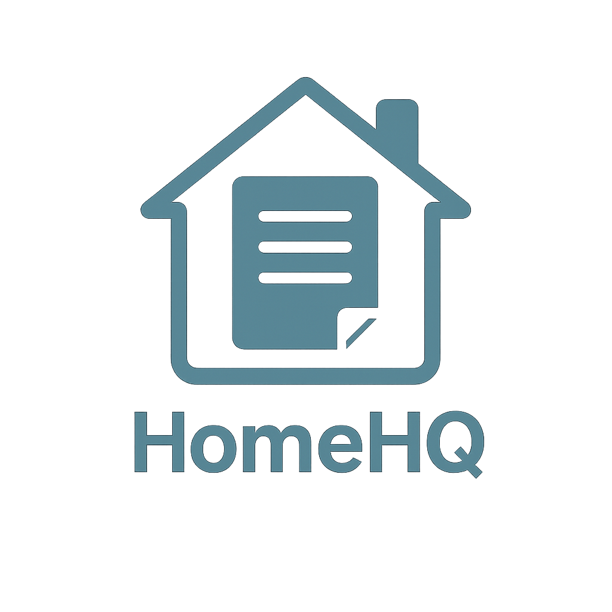
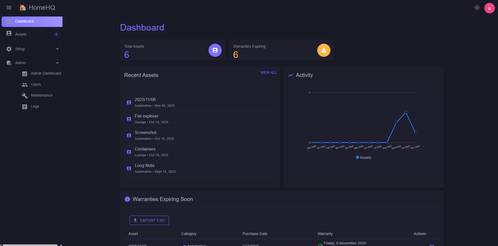
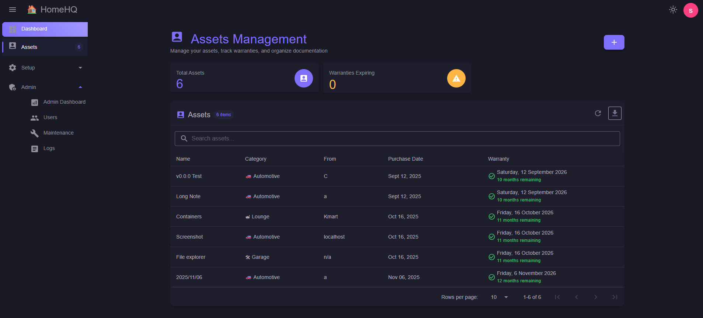
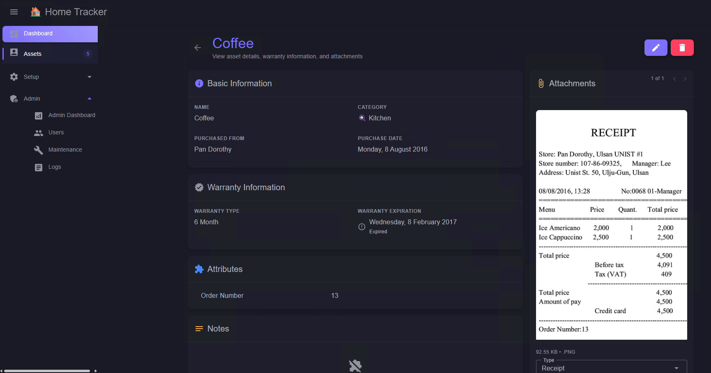

<a id="readme-top"></a>

<!-- PROJECT LOGO -->
<h1 align="center">
    <a href="https://github.com/acrgardiner/homehq">
        
    </a>
</h1>

<p align="center">
Track your key household information in one secure location. Built with .NET and Blazor, HomeHQ helps you organize purchased assets and make receipts readily available.
</p>

<p align="center">
    <a href="https://github.com/acrgardiner/homehq/issues/new?labels=bug&template=bug-report---.md">Report Bug</a> | <a href="https://github.com/acrgardiner/homehq/issues/new?labels=enhancement&template=feature-request---.md">Request Feature</a>
</p>

<!-- TABLE OF CONTENTS -->
<details>
  <summary>Table of Contents</summary>
  <ol>
    <li>
      <a href="#about-the-project">About The Project</a>
    </li>
    <li>
      <a href="#getting-started">Getting Started</a>
      <ul>
        <li><a href="#installation">Installation</a></li>
        <li><a href="#installation">Configuration</a></li>
      </ul>
    </li>
    <li><a href="#contributing">Contributing</a></li>
    <li><a href="#license">License</a></li>
  </ol>
</details>


<!-- ABOUT THE PROJECT -->
## ❔ About The Project

This project was started as a way for me to hone my software development skills while solving a personal need. 

I wanted a way to track my household assets, their warranties, and associated documents in one secure location that I controlled. 

Yes there are other solutions out there, but I wanted something lightweight, self-hosted, and extendable for my purpose.

### Key Features

- Asset details
- Warranty tracking
- Attachments
- Attributes
- Notes
- Inbuilt basic image editing for attachments








<p align="right">(<a href="#readme-top">back to top</a>)</p>


<!-- GETTING STARTED -->
## 🚀 Getting Started

This is an example of how you may give instructions on setting up your project locally.
To get a local copy up and running follow these simple example steps.

### Installation

1. Install via docker

**Start the container with `docker run`**

```sh
# Make sure your local config directory exists
docker run -d \
  --name homehq \
  -p 8080:8080 \
  -v /path/to/appdata:/app/appdata \
  --restart=unless-stopped \
  ghcr.io/acrgardiner/homehq:latest
```

**or `docker-compose`**

```yaml
services:
  homehq:
    image: ghcr.io/acrgardiner/homehq:latest
    container_name: homehq
    volumes:
      - /path/to/appdata:/app/appdata
    ports:
      - 8080:8080
    restart: unless-stopped
```

| Environment Variable | Description | Default Value |
| :--- | :--- | :--- |
|TRUSTED_PROXIES|Comma separated list of IP's for your trusted proxies||

| Mount Paths | Description |
| :--- | :--- |
|appdata||
|appdata/attachments|Storing full resolution attachment|
|appdata/db|Program database for SQLite|
|appdata/logs|Log files|
|appdata/thumbs|Storing compressed thumbnails of attachments|
|appdata/imports|Directory for bulk importing|

### Configuration

Access the web interface via `http://localhost:8080` (or the relevant host/port)

Login with the default system admin user:
   - Username: `sysadmin`
   - Password: `Password123!`

Configure your desired Categories, Warranty Types, and Attachment Types via the setup pages.

Configure your user accounts via the Users page.

### Bulk Import

To bulk import assets, load the files into the `appdata/imports` directory with the filenames matching your desired asset names.

Then from within the Admin > Maintenance page, run the Manual Load.

Assets will be created for each file found in the imports directory and the source file will be moved.

<p align="right">(<a href="#readme-top">back to top</a>)</p>

<!-- CONTRIBUTING -->
## 🤝 Contributing

Contributions are welcome! 

Submit bug reports and feature requests via the GitHub issues page.

Or for developers looking to contribute code, please check and follow our [contribution guidelines](/CONTRIBUTING.md)

<p align="right">(<a href="#readme-top">back to top</a>)</p>

### Top contributors:

<a href="https://github.com/acrgardiner/homehq/graphs/contributors">
  
</a>


<!-- LICENSE -->
## License

Distributed under the GPL-3.0 license. See `LICENSE.txt` for more information.

<p align="right">(<a href="#readme-top">back to top</a>)</p>